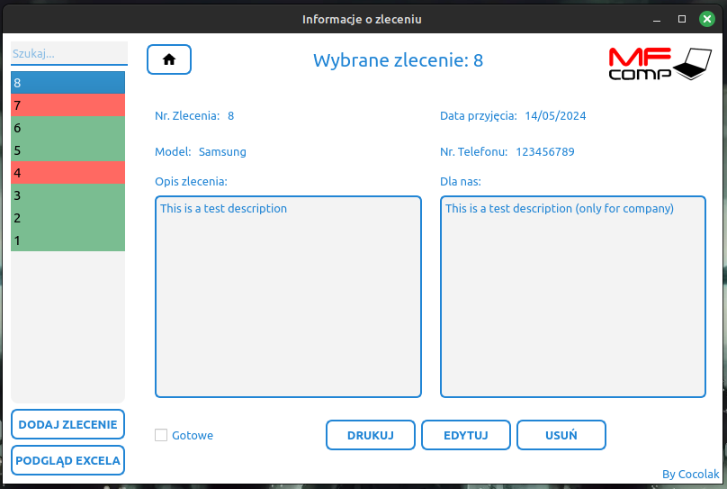

# Order manager for MF Comp
Order manager to computer repair service.

## Requirements
Use the package manager [pip](https://pip.pypa.io/en/stable/) to install required libraries

```bash
pip install -r requirements.txt
```

## Preview



## Usage
- You can easily manage your orders (targeting laptop and phone repairs)
- The order number is taken from the file nr.txt (you can just change this number)
- All data is stored in an excel file data.xlsx (I recommend don't change the data through Excel)
- 'Drukuj' button uses your default printer to print order into paper

### Modules
- [PyQt5](https://doc.qt.io/qtforpython-5/)
- [pandas](https://pandas.pydata.org/)
- [qt-material](https://github.com/UN-GCPDS/qt-material)
- [docx](https://python-docx.readthedocs.io/en/latest/)
- [openpyxl](https://openpyxl.readthedocs.io/en/stable/)